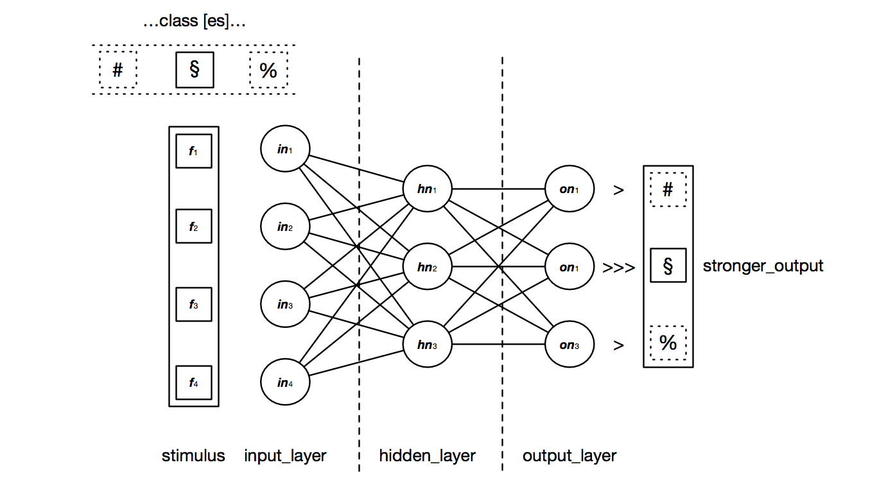
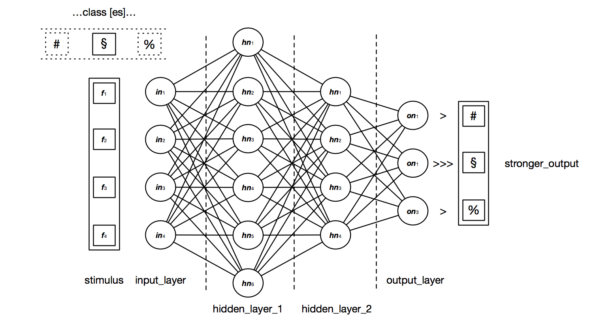

# Go Perceptron

A single / multi level perceptron classifier with weights estimated from sonar training data set using stochastic gradient descent. Recently I added back propagation algorithm over multilayer perceptron network.
The implementation is in dev. Planned features:

- complete future features XD (see above)
- find co-workers
- create a ml library in openqasm (just kidding)
- brainstorming / devtesting other an models

### Updates

2017-10-04: Introduced Recurrent Neural Network (Elman Network) with "learn to sum integer" task. Big refactoring in code (working on)

2017-08-08: Introduced multi layer perceptron network definition with parametric number of hidden layer and neurons. Back propagation algorithm with different transfer function actived - I wanna thank you [dakk](https://github.com/dakk) because I was truly inspired by your code.

2017-08-01: Introduced validation package and k-fold cross validation.

2017-07-31: I started working on ```mlp``` branch for MLP + back prop. It doens't work yet but...I push first commit after some exp in dev. I delete ```dev``` because of some structs optimization.

2017-07-31: we started working on k-fold validation.

### Dependencies

- [logrus](https://github.com/sirupsen/logrus)

### Run test

To run a simple test just open a shell and run the following:

```
git clone https://github.com/made2591/go-perceptron-go
cd go-perceptron-go
go get https://github.com/sirupsen/logrus
go run main.go
```

You can setup a MultiLayerPerceptron using ```PrepareMLPNet```. The first parameter, a simple ```[]int```, define the entire network struct. Example:

- [4, 3, 3] will define a network struct with 3 layer: input, hidden, output, with respectively 4, 3 and 3 neurons. For classification problems the input layers has to be define with a number of neurons that match features of pattern shown to network. Of course, the output layer should have a number of unit equals to the number of class in training set.
The network will have this topology:



- [4, 6, 4, 3] will have this topology:



### To complete yet

- test methods

### Future features

- [mathgl](https://github.com/go-gl/mathgl.git) for better vector space handling
- some other cool neural model XD
